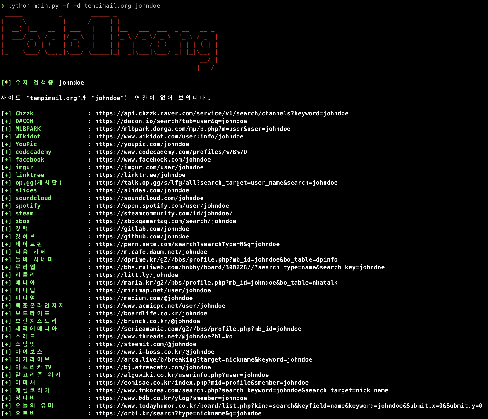

# podoceheng
포도청 프로토타입


# Docker
```bash
sudo docker pull ubuntu:20.04
sudo docker build -t my-python-app .
docker run -it --rm --name my-running-app my-python-app
```

# Execution
```bash
python3 main.py {user ID}
python3 main.py tempuser
```
